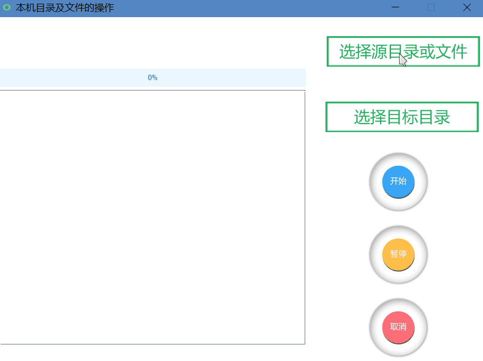

# JAVA LOCAL FILE MOVE
A JAVA HOMEWORK

## DEVELOPMENT ENVIRONMENT
- OS NAME MICROSOFT WINDOWS 10 ENTERPRISE N
- TOTAL PHYSICAL MEMORY 15.9GB
- JAVA(TM) SE RUNTIME ENVIRONMENT(BUILD 1.8.0_131-B11)
- INTELLIJ IDEA 2017.2.1

## IMPLEMENT
- JAVA SWING GRAPHIC INTERFACE
- RANDOMACCESSFILE SUB-FILES COPY&MOVE
- INHERIT FROM THREAD TO PAUSE, MOVE, CANCEL

## DISADVANTAGE
- BUGS AFTER CLICKING START/PAUSE CONTINUOUSLY

## DEMO

